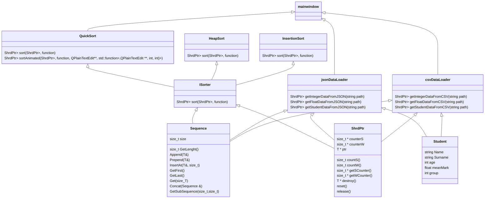

# Second lab by Bredihin Vladimir B23-554
## Qt 6.8.1
 ## Project sructure
 

```mermaid
classDiagram
	  jsonDataLoader<|-- Student
	  csvDataLoader<|-- Student
	  ISorter<|-- Sequence
	  ISorter<|-- ShrdPtr
	  jsonDataLoader<|-- ShrdPtr
	  jsonDataLoader<|-- Sequence
	  csvDataLoader<|-- ShrdPtr
	  csvDataLoader<|-- Sequence
	  QuickSort<|-- ISorter
	  HeapSort<|-- ISorter
	  InsertionSort<|-- ISorter
	  mainwindow<|-- QuickSort
	  mainwindow<|-- csvDataLoader
	  mainwindow<|-- jsonDataLoader
	  class ISorter{
		  ShrdPtr<Sequence<T>> sort(ShrdPtr<Sequence<T>>, function<bool(T,T)>)
	  }
	  
	  class mainwindow{
	  }
	  
	  class QuickSort{
		  ShrdPtr<Sequence<T>> sort(ShrdPtr<Sequence<T>>, function<bool(T,T)>)
		  ShrdPtr<Sequence<T>> sortAnimated(ShrdPtr<Sequence<T>>, function<bool(T,T)>, 	QPlainTextEdit**, std::function<void(ShrdPtr<Sequence<T>>,QPlainTextEdit **, int, int)>)
	  }
		
	  class HeapSort{
		  ShrdPtr<Sequence<T>> sort (ShrdPtr<Sequence<T>>, function<bool(T,T)>)
	  }
		
	  class InsertionSort{
		  ShrdPtr<Sequence<T>> sort (ShrdPtr<Sequence<T>>, function<bool(T,T)>)
	  }
			
	  class jsonDataLoader{
		  ShrdPtr<Sequence<int>> getIntegerDataFromJSON(string path)
		  ShrdPtr<Sequence<float>> getFloatDataFromJSON(string path)
		  ShrdPtr<Sequence<Student>> getStudentDataFromJSON(string path)
	  }
	  
	  class csvDataLoader{
	  ShrdPtr<Sequence<int>> getIntegerDataFromCSV (string path)
	  ShrdPtr<Sequence<float>> getFloatDataFromCSV (string path)
	  ShrdPtr<Sequence<Student>> getStudentDataFromCSV (string path)
	  }
	  
      class ShrdPtr{
	      size_t * counterS
	      size_t * counterW
          T * ptr
          size_t countS()
          size_t countW()
          size_t * getSCounter()
          size_t * getWCounter()
          T * destroy()
          reset()
          release()
      }

	class Sequence{
		size_t size
		size_t GetLenght()
		Append(T&)
		Prepend(T&)
		InsertAt(T&, size_t)
		GetFirst()
		GetLast()
		Get(size_T)
		Concat(Sequence &)
		GetSubSequence(size_t,size_t)
	}
   class Student{
	   string Name
	   string Surname
	   int age
	   float meanMark
	   int group
   }
```
